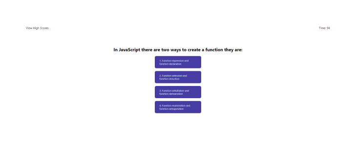
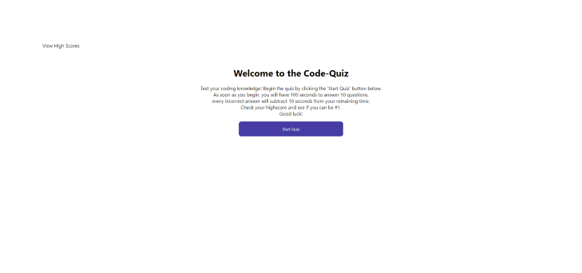

#  **Code Quiz**

This is the (mostly)completed fourth weekly challenge for the UPENN LPS Coding Bootcamp.
This project required us to build a multi-question JavaScript trivia game from scratch.  This assignment had to meet multiple criteria to be considered complete.  These included:
- **Requirements**
    - Creating an HTML document from scratch.
    - Creating a CSS file to style the quiz.
    - Create a JavaScript file that would dynamically create questions in the browser using DOM manipulation.

## **Link**

Here is a link to the [deployed application](https://gintstir.github.io/code-quiz/) 

Here is a link to the [github repository](https://github.com/Gintstir/code-quiz)

## **Motivation**

This was a very difficult challenge.  It helped reinforce some very- for me at least- hard-to-grasp concepts.  These included:
- learning introductory JS.
- Gaining a better understanding of JS syntax and structure
- Learning about and implementing:
    - DOM manipulation
    - object methods
    - Functions
    - User input
    - Loop syntax
    - The list goes on and on.

  

## **Build Status**

This Code Quiz is sadly not complete.  The user is unable to store their initials/highscore in localStorage.  

## **Code Style**

This project was built from the groud up using:
    - CSS
    - HTML
    - JavaScript

## **Screenshots**  
This is a screenshot of the mock up we were to use as a guide:

>

Here are some screenshots of the deployed site:

>
>

## **Tech Used**

- Built With
    - CSS
    - HTML
    - Javascript    
    - Lots of Youtube videos
    - And of course MDN
    
    

## **Credits**

Thanks to UPennLPS Coding Bootcamp. Thank you to the bootcamp instructors and TA's for all their help along the way ❤.  
